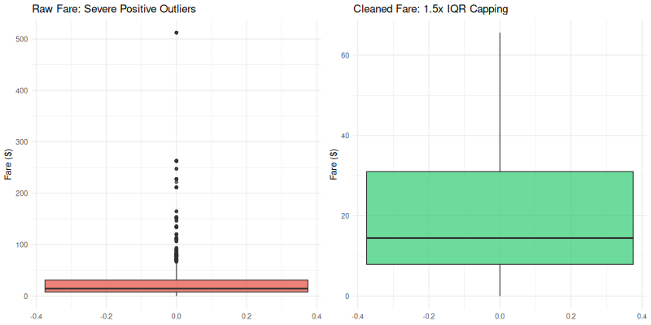
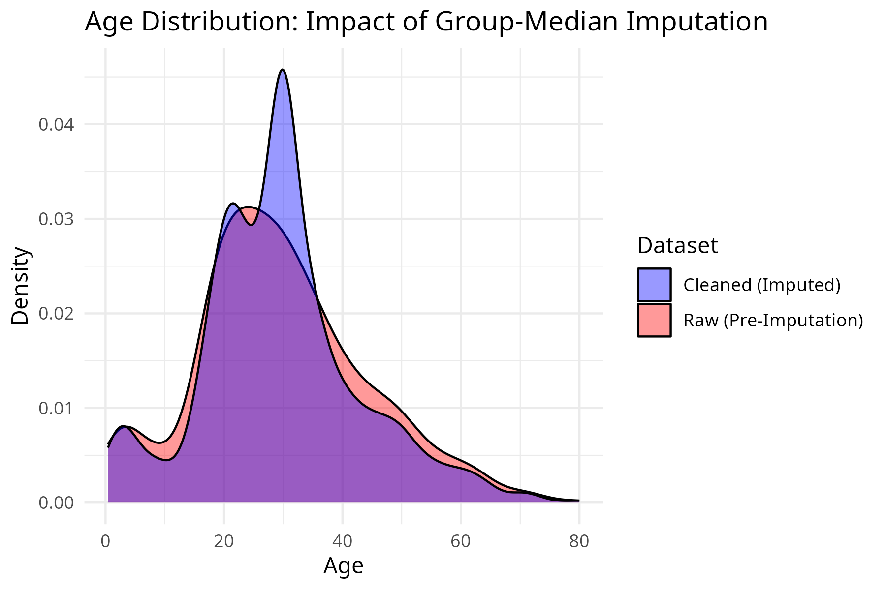
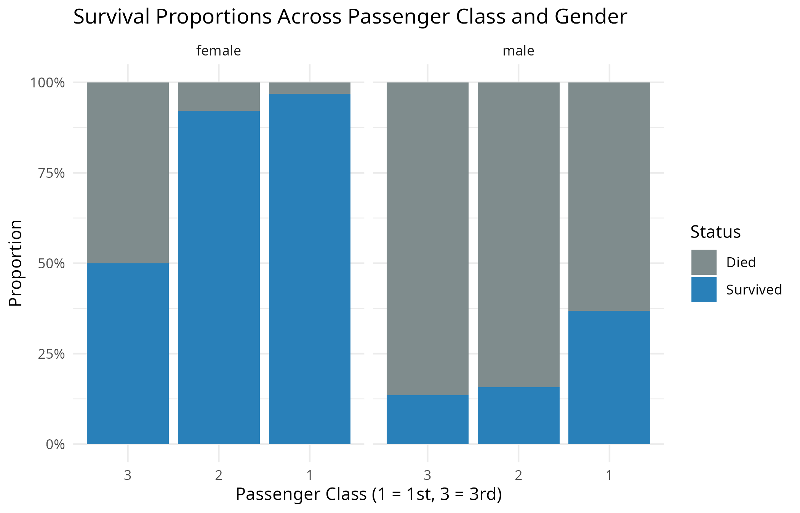
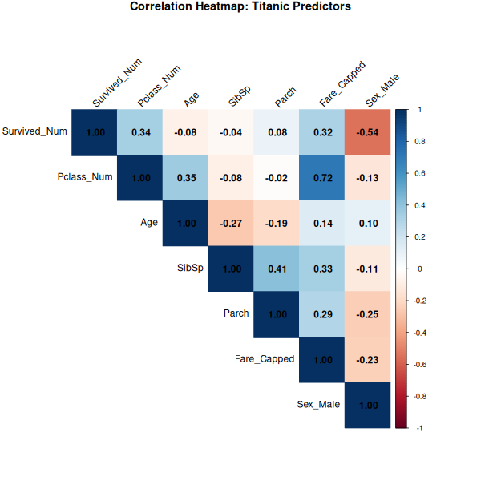

# Titanic Extended: Data Cleaning & Exploratory Data Analysis in R

An end-to-end data preprocessing, imputation, and exploratory analysis pipeline built with R and the Tidyverse ecosystem.

## Overview
This project addresses real-world data challenges in the Titanic passenger dataset, focusing on systematic missingness handling, outlier mitigation, and categorical transformation prior to downstream modeling.

## Key Preprocessing Steps
- **Missing Value Imputation**:
  - `Age`: Extracted honorific titles (`Mr`, `Mrs`, `Miss`, `Master`, `Rare`) and imputed missing ages based on subgroup medians rather than a single global metric.
  - `Embarked`: Imputed using mode replacement (`S`).
  - `Cabin`: High missingness (>77%) handled by engineering a structural `Deck` factor while preserving an `"Unknown"` level.
- **Outlier Mitigation**:
  - `Fare`: Applied Tukey's $1.5 \times \text{IQR}$ upper-bound capping (Winsorization) to neutralize extreme fare outliers without dropping rows.
- **Feature Engineering & Scaling**:
  - One-hot encoding on nominal features (`Sex`, `Embarked`).
  - Ordinal factor ranking on `Pclass`.
  - Log transformation, Min-Max scaling, and Z-score standardization on continuous variables.

## Visual Insights

### 1. Fare Outlier Treatment (Pre vs. Post Capping)


### 2. Age Distribution: Subgroup Median Imputation


### 3. Survival Proportions by Class and Sex


### 4. Correlation Matrix


## Tech Stack
- **Language**: R (v4.x)
- **Core Libraries**: `tidyverse` (`dplyr`, `ggplot2`, `tibble`, `tidyr`, `stringr`), `titanic`, `corrplot`, `scales`, `gridExtra`, `e1071`
- **Platform**: Posit Cloud / RStudio

## How to Run
```r
# Clone the repository
git clone [https://github.com/your-username/titanic-data-cleaning-eda-r.git](https://github.com/your-username/titanic-data-cleaning-eda-r.git)

# Run script
source("scripts/data_cleaning_pipeline.R")
```
